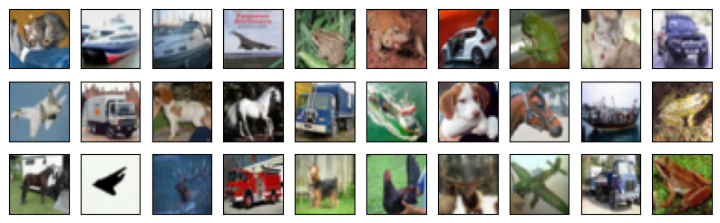

<h1 align="center">
  <b>PyTorch VAE</b><br>
</h1>

<p align="center">
    <a href="https://www.python.org/">
    </a>
    <a href= "https://pytorch.org/">
    </a>
    <a href= "https://github.com/baohuy11/Variational-autoencoder/blob/main/LICENSE">
    </a>
</p>

A simple tutorial of Variational AutoEncoder(VAE) models. This repository contains the implementations of following VAE families.


* [Variational AutoEncoder](https://arxiv.org/pdf/1312.6114.pdf) (VAE, D.P. Kingma et. al., 2013)
* [Vector Quantized Variational AutoEncoder](https://arxiv.org/pdf/1711.00937.pdf) (VQ-VAE, A. Oord et. al., 2017)

# Requirements
```bash
pip install -r requirements.txt
```

# How-to-use
simply run the <file_name>.ipynb files using jupyter notebook.

# Experimental Results
## Variational AutoEncoder (VAE)
- Trained on MNIST dataset for 10 epochs

- Origin data

 

- Reconstructed data


- Generated random samples from noise vector


- MNIST latent space


## Vector Quantized Variational AutoEncoder (VQ-VAE)
- Trained on CIFAR-10 dataset for 10 epochs

- Origin data

 

- Reconstructed data


- Generated random samples from noise vector


